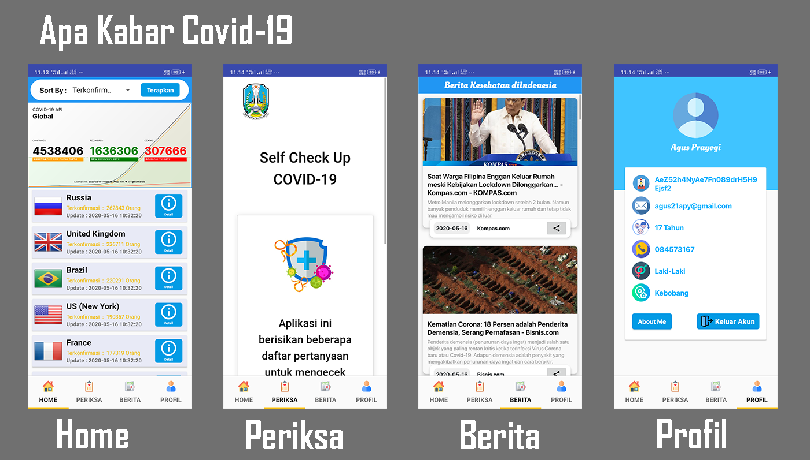
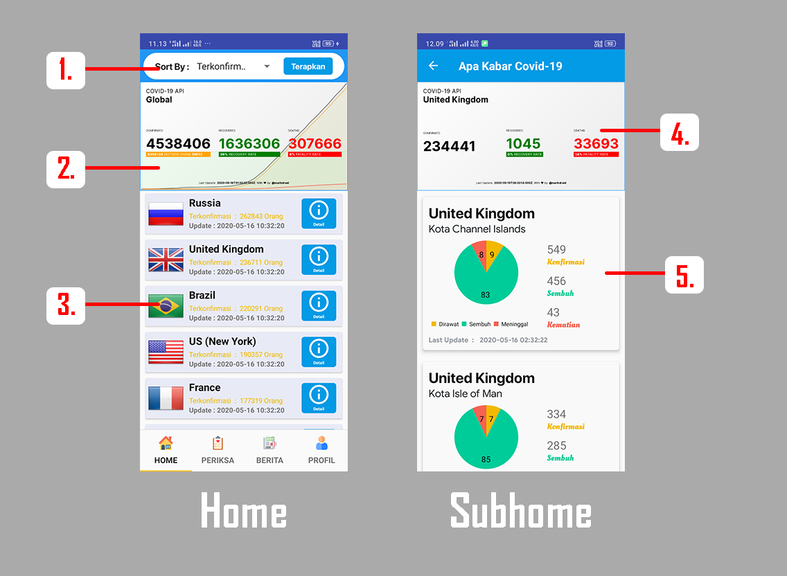
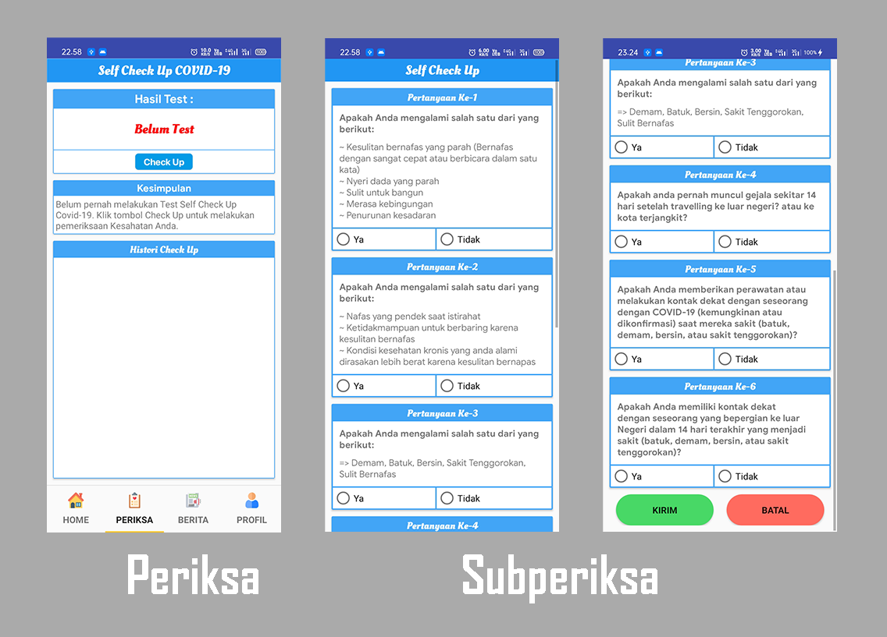
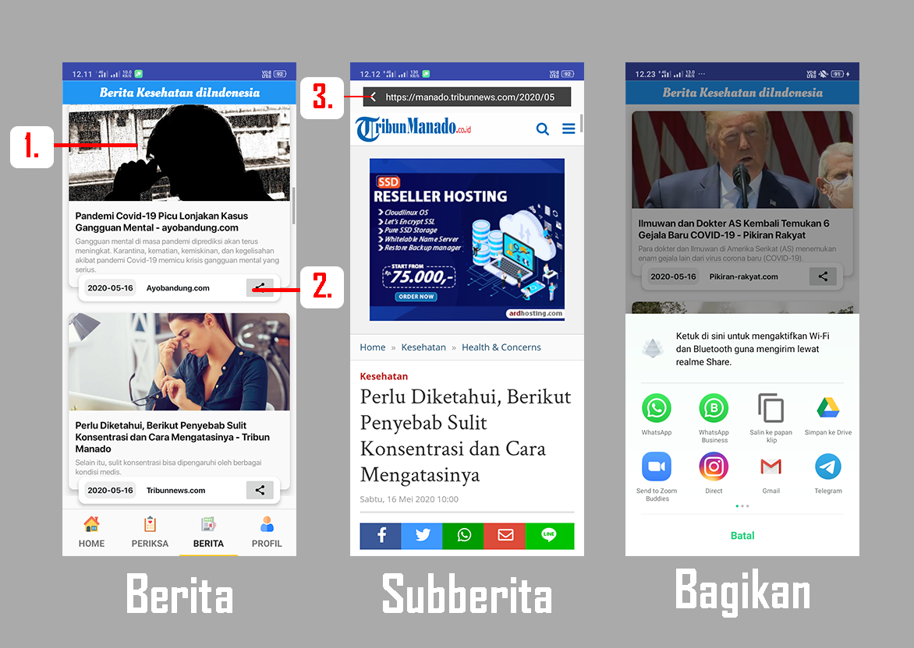
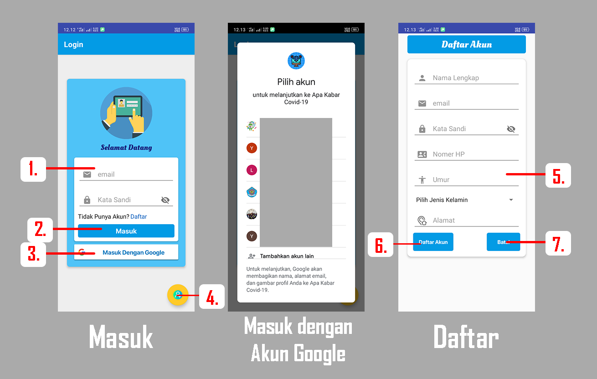

# SMKCodingOI_CHALLENGE02

### Aplikasi Apa Kabar Covid-19

Memantau Perkembangan dan Berita terbaru seputar Covid-19 sekarang bisa lewat aplikasi android lho😊.\
Buruan download aplikasinya di sini => [Apa Kabar Covid-19](https://drive.google.com/file/d/1YQA4XkzARpVE1u5_L7IwjTXhuIQ6NoL4/view?usp=sharing)

Sumber APi :

1. [Api Covid-19](https://covid19.mathdro.id/)
2. [Api Berita](https://newsapi.org/)

#

## **Halaman Utama**

#

## **1. Halaman Home**

\
**Penjelasan :**

1. Pengurutan Kasus => dapat menggurutkan kasus berdasarkan yang telah dipilih dimenu Dropdown dan setelah diklik terapkan maka akan terurutkan.
2. Kasus Covid-19 diseruruh dunia => daftar kasus yang ada diseluruh dunia
3. Kasus berdasarkan Negara (Negara bagian) => jika Tombol detail dipilih maka akan masuk kedalam halaman Subhome
4. Kasus seluruh Negara yang dipilih dihome => kasus yanga ada dalam suatu Negara
5. Kasus Berdasarkan Negara Bagian => rincian dari kasus yang ada dalam suatu Negara jika memiliki negara bagian

#

## **2. Halaman Periksa**

\
**Penjelasan :**

Digunakan untuk mengecek apakah anda terpapar virus Corona dan agar anda bisa tahu gejala awal Virus ini.\
1. Tombol Check Up => untuk menampilkan menu SupPeriksa
2. Kesimpulan => untuk memberi saran kepada user 
3. SubPeriksa => digunakan untuk memeriksa kondisi kita sekarang dengan menjawab pertanyaan yang ada

#

## **3. Halaman Berita**

halaman untuk melihat berita seputar kesehatan diindonesia

\
**Penjelasan :**

1. isi berita (_dapat diklik diarea gambar_) => jika diklik maka akan masuk kedalam halaman Subberita, jika terjadi masalah pada link maka akan langsung masuk kedalam Browser.
2. Tombol Bagikan => dapat membagikan link dari berita yang dituju keberapa aplikasi seperti pada gambar.
3. Tombol Kembali => Kembali Kehalaman Home

#

## **4. Halaman Profil**

\
**Penjelasan :**

1. Tombol About Me => untuk masuk kedalam halaman About.
2. Tompol Keluar Akun => untuk keluar dari akun email / google yang sedang digunakan.
3. Tombol Kembali => untuk kembali kedalam halaman Home
4. Tombol Edit Profil => untuk menggubah data user account

#

## **5. Halaman Proses Masuk**

\
**Penjelasan :**

1. Form masuk => untuk memasukkan email dan password agar bisa masuk.
2. Tombol Masuk => tombol untuk masuk kedalam akun yang telah dimasukkan.
3. Masuk dengan Akun Google => tombol untuk masuk aplikasi dengan menggunakan akun google.
4. tombol daftar akun => untuk masuk kedalam halaman daftar akun
5. Form daftar => untuk memasukkan data yang akan digunakan untuk masuk kedalam aplikasi.
6. Tombol Daftar => untuk mensubmit data agar bisa mendaftar kedalam aplikasi.
7. Tombol Batal => untuk membatalkan Pendaftaran akun dan akan masuk kedalam halaman masuk.

**catatan :**

Akun yang dibuat datanya akan disimpan diFirebase Database Realtime, dan Firebase Auth.\
untuk info dokumentasi lengkapnya kunjungi => [Firebase](https://firebase.google.com/docs/)

#
